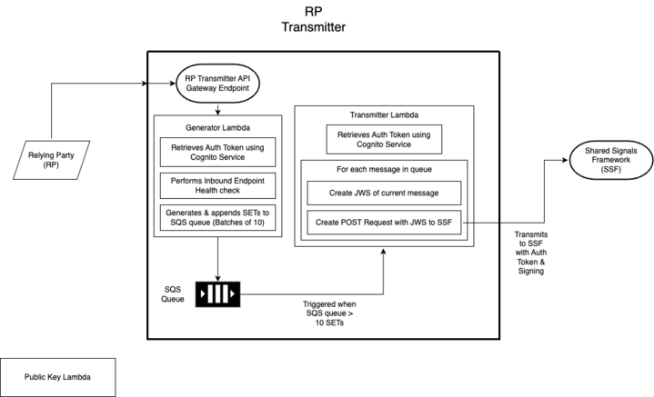
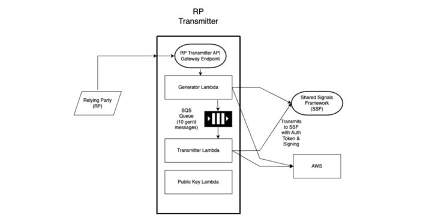

# The Relying Party Transmitter

This is the source code for the Relying Party Transmitter (RPT) which is responsible for transmitting messages from Relying parties (RPs) to the Shared Signals Framework (SSF).


---

## 1. Setup

---

### 1.1. Development Environment Set Up

Setup your environment using the following tools:

- VS Code - [Install VS Code](https://code.visualstudio.com/download)
- SAM CLI - [Install the SAM CLI](https://docs.aws.amazon.com/serverless-application-model/latest/developerguide/serverless-sam-cli-install.html)
- Node.js - [Install Node.js](https://nodejs.org/en/), including `npm`.
- Docker - [Install Docker community edition](https://docs.docker.com/desktop/)
- pre-commit - [Install pre-commit](https://pre-commit.com)
- run `pre-commit install` to ensure the hooks are installed
  A successful `pre-commit install` will yield the following output:

  ```
  pre-commit installed at .git/hooks/pre-push
  pre-commit installed at .git/hooks/pre-commit
  ```

The following extensions should be installed for VSCode:

- [AWS Toolkit](https://docs.aws.amazon.com/toolkit-for-vscode/latest/userguide/welcome.html) - The AWS Toolkit can be connected through SSO using `aws configure sso` and then selecting the correct profile at the bottom of VSCode.

- [SonarLint](https://marketplace.visualstudio.com/items?itemName=SonarSource.sonarlint-vscode) - SonarLint should be connected through the `Connected Mode` it offers. Once it has been connected, creating the binding of your local repo to the `di-fraud-mock-rp` repo on `SonarCloud`.
  This should add `problems`, which is accessed by `View` -> `Problems`.

### 1.2. Local Build and Invocation

#### Pre-Commit

Install `pre-commit` to local repo at root directory

```bash
pre-commit install
```

#### Local Development

Install `npm` dependancies

In order to install packages from fraud-npm, such as @govuk-one-login/logging, an .npmrc file is required in the root folder. This file must contain a Personal Access Token (PAT) with 'read-packages' permissions in the following format:

@govuk-one-login:registry=https://npm.pkg.github.com
//npm.pkg.github.com/:\_authToken=<generated-token>

For guidance on generating a PAT, refer to the documentation: Managing Your Personal Access Tokens.

https://docs.github.com/en/authentication/keeping-your-account-and-data-secure/managing-your-personal-access-tokens

Once the PAT is generated and the .npmrc file is added use the following command to install npm packages:

```bash
npm i
```

Build your application with the `sam build` command.

```bash
sam build --template template-mock-rp.yaml --region eu-west-2
```

To run functions locally you can invoke them with the `sam local invoke` command.

```bash
sam local invoke TransmitterLambda
```

To run your function locally with an event, use the `--event` parameter.

```bash
sam local invoke TransmitterLambda --event event.json
```

An example `SQSEvent` stored in `event.json` file for the `TransmitterLambda`:

```JSON
{
  "Records":
  [
    {
      "messageId": "19dd0b57-b21e-4ac1-bd88-01bbb068cb78",
      "receiptHandle": "MessageReceiptHandle",
      "body": {
        "SET": {
          "iss": "https://issuer.digitalIdentity.gov/",
          "jti": "756e697175654964656e74696669657230",
          "iat": 1520364019,
          "aud": "https://audience.hmrc.gov/",
          "events": {
            "https://schemas.digitalIdentity.gov/secevent/risc/event-type/ipv-spot-request-recieved": {
              "subject": {
                "format": "iss_sub",
                "iss": "https://issuer.digitalIdentity.gov/",
                "sub": "aPairwiseId"
              }
            }
          },
        "Destination": "inbound-ssf.development.account.gov.uk"
        }
      },
      "attributes": {
        "ApproximateReceiveCount": "1",
        "SentTimestamp": "1523232000000",
        "SenderId": "123456789012",
        "ApproximateFirstReceiveTimestamp": "1523232000001"
      },
      "messageAttributes": {},
      "md5OfBody": "7b270e59b47ff90a553787216d55d91d",
      "eventSource": "aws:sqs",
      "eventSourceARN": "arn:aws:sqs:us-east-1:123456789012:MyQueue",
      "awsRegion": "eu-west-2"
    }
  ]
}
```

This can be easily generated for any event using the following `sam` command:

```bash
sam local generate-event <service> <event>
```

For example, to generate an `SQS` service `receive-message` event:

```bash
sam local generate-event sqs receive-message
```

### 1.3 CloudFormation Deployment

The `deploy-branch.yaml` action should be used to deploy branches of the Mock RP to the AWS development environment.

[See here](https://govukverify.atlassian.net/wiki/spaces/FPAD/pages/3684270595/Manual+Testing+of+Deployed+Branches) for a guide on branch deployment.

---

## 2. Activation Endpoint Use

---

The API endpoint can be used to trigger an RPT Service run. The following values can be used to change the configuration of the run:

- **numMessages**: The number of messages to send as a result of said invocation.
- **eventTypleSplit**: The ratio of messages containing certain events, currently assuming only 2 types of event.
- **errorRate**: Number between 0-1, which is the probability of the generated SET containing an error in formatting.
- **inboundEndpointURL**: The endpoint of the SSF pipeline to which the RPT will be sending messages.

No field is specifically required to be configured, if a given field is not provided a value then it will be set to the default. A template body of the POST request using the default values is shown below:

```typescript
{
    "numMessages": 1,
    "eventTypeSplit": {
        "accountPurged": 1,
        "accountCredentialChangeRequired": 0,
        "accountDisabled": 0,
        "accountEnabled": 0,
        "credentialCompromise": 0,
        "optIn": 0,
        "optOutInitiated": 0,
        "optOutCancelled": 0,
        "optOutEffective": 0,
        "recoveryActivated": 0,
        "recoveryInformationChanged": 0,
        "sessionsRevoked":0
    },
    "errorRate": 0,
    "inboundEndpointURL" : "inbound-ssf.development.account.gov.uk"
}

```

This JSON must be sent via a POST request to the endpoint of the RPT, the URLs for the main RP Service in each environment are:

development: TBD
build: TBD
staging: TBD

---

## 3. Implementation

---



### 3.1. Generator Lambda

#### 3.1.1. Summary

The Generator Lambda generates messsages based on configuration parameters to pass to the [Transmitter Lambda](#Transmitter-Lambda) using SQS.

#### 3.1.2. Detailed Description

The Generator Lambda is triggered by an API Gateway event containing configuration parameters which are parsed using the [ConfigParams](#ConfigParams) class.

The Lambda then does a Healthcheck to ensure the SSF Endpoint can be reached before generating any messages.

It then generates messages using the `ConfigParams` values and sends them in batches of 10 messages to the Transmitter Lambda using AWS `Simple Queue Service`. Any messages that fail to send are added to the dead letter queue.

When the Lambda finishes running, the number of failed messages are counted and that amount of messages are regenerated and sent by the Lambda. This will be repeated up to 5 times.

The Lambda will then report the number of successful messages sent, failed messages and the details of the ConfigParams it used.

---

### 3.2. Transmitter Lambda

#### 3.2.1. Summary

The Transmitter Lambda receives messages from the [Generator Lambda](#Generator-Lambda) via SQS. It then makes POST requests to the `SSF Endpoint`.

#### 3.2.2. Detailed Description

The `SQS` messages from the `Generator Lambda` are received as an `SQS` event act as the triggers for the `Transmitter Lambda`.

`JSON Web Tokens (JWT)` are used to ensure the payload can be verified it came from who it says it has, and that it can be transmitted encrypted over the internet.

First, the `SET` from the body of the `SQS` messages is packaged into a `JSON Web Signature (JWS)`. The signature is generated directly from AWS using a `private key`. The Inbound-SSF pipeline can verify it was sent by us when they use the `public key`, from the private key pair used to generate the signature.

Second, the `JWS` is then packed into a `JSON Web Encryption (JWE)`. The JWE generates a random cipher to encrypt the data every time, but that is also encrypted and sent as part of the `JWE`. To encrypt the payload (the `JWS` at this point), the randomly generated cipher is used, and the output is stored in the `JWS` ready to be sent.

The `Content Encryption Key (CEK)`, A.K.A the cipher is then encrypted using a public key from the Inbound-SSF, and then stored in the `JWS` ready to be sent.

The `JWS` is then packaged into a post request and sent to the endpoint of the `Inbound-SSF pipeline`, defined in the destination field of the `SQS` message body.

---

### 3.3. Public Key Lambda

#### 3.3.1. Summary

This Lambda simulates an RP's endpoint for serving their public key. Triggered by API Gateway requests, it fetches a public key from AWS KMS for SET verification.

Inbound-SSF will then recieve this public key to verify the SETs

#### 3.3.2. Detailed Description

The Lambda is triggered by an API Gateway Request and the `PublicKeyARN` is fetched from `SSMParams`.

The public key is retreived from KMS using the `KeyManager` class and exported in `PEM` format.

The public key data is exported and converted to base64 format and a response is created with a 200 status code and the public key in the body.

Successful retrieval of the public key is logged by the `FraudLogger`. Any errors in any step are also logged and a 500 status code and an error message is returned in case of failure.

---

# 4. Src/Common

---

## 4.1. Classes

### 4.1.1. ConfigParams

This class handles the parsing and storing of the parameters passed through from the activation endpoint. When instantiated it constructs with the default values, then the `parseAllApiParams()` method checks the API event for any overrides, validates them, and stores them in place of the default values.

### 4.1.2. JWS & JWE

These classes hold the logic for coverting the SET messages received in the `Transmitter Lambda` into a valid JWE to be sent to the `SSF Endpoint`.

### 4.1.3. MockEvents

This class handles the generation of the `events` field of each `SET`, and is called within the `MockSET` class logic. The `EventMapping` handles the mapping of the requested event type to returning teh right class for that event.

The `BaseEvent` object handles the events that follow the standard structure with the event specific values added through the mapping.

For events with atypical structures, each has their own class that extends the `BaseEvent` class which the mapping will point to.

### 4.1.4 MockSET

This class handles the generation of the mock `SETs`. It uses the `configParams` values to generate the data and return a full SET.

It will instantiate with default values which are then overrided by the calling of each of the methods - some of which depend on others.

## 4.2. Other

### 4.2.1. Logging / Tracing

AWS Powertools is used within the Project to log events from inside each Lambda. These logs are sent to Cloudwatch. Different levels of logs can be recorded using the following methods in the PowerTools package;

```TypeScript
logger.debug()
logger.info()
logger.error()
logger.critical()
```

##### Example logging method

```TypeScript
 /**
   * Send Started Processing Event log
   *
   * @param messageId
   */
  logStartedProcessing = (messageId?: string): void => {
    this.logger.info(LogEvents.StartedProcessing, { messageId });
    this.metrics.addMetric(LogEvents.StartedProcessing, MetricUnits.Count, 1);
  };
```

##### Example output in Cloudwatch

```JSON
{
    "level": "INFO",
    "message": "Started Processing",
    "service": "inboundSSF",
    "timestamp": "2023-05-25T09:20:32.132Z",
    "xray_trace_id": "1-646f285f-4d67c24bfe2a7a5e227973e0",
    "messageId": "d001fb5c-03c7-4519-bf31-c22aededc339"
}

```

Powertools tracing can be used to track a single event / message throughout the entire inbound pipeline, showing the time taken to process by each Lambda, with the ability to break each lambda’s code down into segments for monitoring.

**NOTE: Decorators can only be used on Class methods, and are not supported on individual functions.**

Capturing Lambda handlers can be done by adding the captureLambdaHandler middleware to the Handler method

```TypeScript
export const handler = middy(
  transmitterLambda.handler.bind(transmitterLambda)
).use(captureLambdaHandler(fraudTracer));
```

AWS SDK clients can be wrapped with the captureAWSv3Client method to trace all method calls using that package

```TypeScript
const sqsClient = fraudTracer.captureAWSv3Client(
  new SQSClient({
    region: process.env.AWS_REGION,
  })
);
```

### 4.2.2. Queues

SQS queues are used between the Lambdas. The `Generator Lambda` outputs events into the `SETTransmitterQueue`, which is used as an event source for the `Transmitter Lambda`.

All SQS queues have Dead Letter Queues associated with them. If a message fails to be processed by the `Generator Lambda`, it will retry for a number of times setout by the queue redrive policy. Once this has been reached, the message will then be transferred to the DLQ associated with the queue.

The JWS is then packaged into a post request and sent to the endpoint of the Inbound-SSF pipeline.

# Troubleshooting

## AWS Type Error

If you ever encounter type errors _only_ after deployment, try these fixes:

### Ensure uses of `async` are `await`-ed using `Promise.resolve`

> ❌ `let a = await func()`
> ✅ `let a = await Promise.resolve(func())`

### Use `console.log` to ensure `type` is correct.

> **NOTE:** For some reason these can change when deploying 🤷

#### AWS:

```typescript
func a(data: Buffer) {
  console.log(data) // Promise<Buffer>
  data = await Promise.resolve(data)
  console.log(data) // Buffer
}
```

#### Local:

```typescript
func a(data: Buffer) {
  console.log(data) // Buffer
}
```
